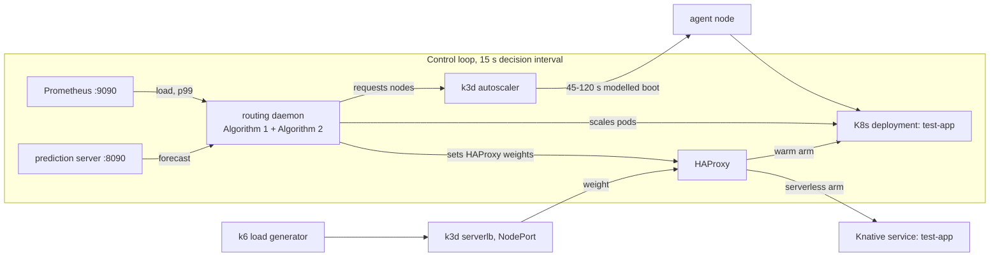

# Hybrid K3s-Serverless Architecture with GRU Workload Prediction

Master's thesis: *Decision Making and Elastic Scalability Management in Heterogeneous Cloud Environments Based on Workload Prediction*. The research is complete; the harness, the experiments, and the thesis book are in this repository.

This page is the map: what the system is, how to run one experiment, and where to read more. Every command below runs from the repository root. Terms this repository uses in a specific way are in the [glossary](docs/GLOSSARY.md).

**Status.** Research complete. The experiments have run, the thesis book is written, and this harness is kept in working order so the evidence can be reproduced. Superseded material lives under `archived/` with a banner.

**Author and contact.** Muhammad Zahid Masruri. Open an issue on this repository for anything about the code or the evidence.

Contents: [what the system is](#what-the-system-is) · [where things live](#where-things-live) · [run it](#run-it) · [how an experiment runs](#how-an-experiment-runs) · [what you can do](#what-you-can-do) · [tests](#tests) · [evidence rules](#evidence-rules) · [read more](#read-more)

## What the system is

Ten requests per second arrive at HAProxy, which splits them between two arms: a Kubernetes deployment that holds warm capacity, and a Knative service that scales to zero. A GRU model forecasts the next 135 seconds of load (9 steps of 15 seconds). The routing daemon reads that forecast, the observed queue, and the SLO, then decides how much traffic each arm takes and whether the node tier needs another machine.



Four scenarios are compared, and only two things separate them:

| Scenario | Pods | Nodes | Routing |
|---|---|---|---|
| S1 k8s-only | HPA on CPU | k3d autoscaler | 100% K8s |
| S2 serverless-only | Knative KPA | none | 100% Knative |
| S3 hybrid-reactive | Algorithm 2 on observed load | k3d autoscaler | capacity-driven |
| S4 hybrid-predictive | Algorithm 2 on the GRU forecast | k3d autoscaler | capacity-driven |

The measured SLO is p99 below 200 ms over a 30-second window. H1, H2, and H3 are answered in `results/claims/CLAIMS_TO_EVIDENCE.md`.

## Where things live

```text
libs/
├── shared/     # models, protocols, statistics, storage, artifact readers - the floor
├── infra/      # cluster lifecycle, readiness, residue, deploys, Prometheus, the `thesis infra` CLI
└── analysis/   # loaders, paired comparison, cost model, cold-start, the per-bundle evidence views
apps/
├── cli/        # the `thesis` entry point; no arguments prints live state
├── experiment/ # profiles, the conditions gate, stages, series, summary, the evidence registry
├── analysis/   # `thesis analysis`: runs, mechanism, variance, cost, plots, hypotheses
├── prediction/ # GRU service and training (:8090)
├── routing/    # routing daemon, Algorithm 1 (V1/V2/V3) and Algorithm 2 (:9104)
└── dashboard/  # Streamlit views over finished bundles
results/        # the only home of experiment evidence: bundles, registry, claims map
thesis-typst/   # the canonical thesis book; thesis/chapters/ is the markdown draft
data/           # ClarkNet and Calgary traces, processed parquet, k6 stage files
docs/           # guides, specs, references - start at docs/README.md
archived/       # read-only history, including superseded docs
```

`controller/`, `ml_models/`, and `experiments/` are pre-refactor trees. They are not workspace members and nothing imports them.

## Run it

### 1. Install

```bash
git lfs install    # once per clone: reference PDFs and result parquet are LFS objects
uv sync            # the whole workspace, Python 3.12
```

The testbed also needs Docker, kubectl, k3d, and k6. On an AMD GPU, export `HSA_OVERRIDE_GFX_VERSION=11.0.0` before training.

### 2. Ask where you stand

```bash
uv run thesis
```

```text
bin: ~/work/master-s2-study/thesis-kubernetes-serverless-integration/.venv/bin/thesis
repo: ~/work/master-s2-study/thesis-kubernetes-serverless-integration
testbed: both clusters running
predictor: answering on 8090 (200)
latest: 2026-09-12_h2-pair — 10 run(s), H2 not supported at 5 pairs

next: thesis infra status
next: thesis experiment preflight --profile h2-pair
next: thesis analysis runs results/experiments/phase-b/2026-09-12_h2-pair
```

### 3. Bring the testbed up and check it

```bash
uv run thesis infra setup            # both clusters, Knative, HAProxy, Prometheus (first run pulls images)
uv run thesis infra ensure --agents 1 # converge to a runnable shape with one static agent node
uv run thesis infra status
uv run thesis experiment preflight --profile smoke --no-converge
```

`preflight` is the gate every run passes. It checks that the nodes are Ready, that both arms answer, that the prediction server responds when the profile needs one, and that the host is idle enough to measure on. If a check fails, the run is refused and the reason is written into the bundle.

### 4. Run one pair, then read it

```bash
uv run thesis experiment reproduce --profile smoke
```

The run writes `results/experiments/phase-b/<date>_smoke-1p/`. Read it without touching it:

```bash
uv run thesis analysis runs results/experiments/phase-b/<date>_smoke-1p
```

```text
scenario                run  valid p99 ms
s3-hybrid-reactive        1   True  215.0
s4-hybrid-predictive      1   True  130.2

2 run(s); host load is the conditions gate's busy-to-cores ratio.
next: thesis analysis mechanism results/experiments/phase-b/<date>_smoke-1p
```

Long runs use the profiles in `apps/experiment/experiment/profiles.py`: `h2-pair` (counterbalanced S3/S4 pairs with one static agent, the regime H2 is about), `h2-pair-abundant`, `s4-point-sizing`, `s4-point-sizing-shrink`, `baselines`, `quad`, `smoke`.

## How an experiment runs

```text
profile (scenarios, design, static agents, does it need the predictor)
  -> conditions.apply
       converge testbed: static agent count, delete leftover nodes and orphaned pods
       check: nodes Ready, arms serving, predictor up, host quiet
       refuse loudly: raise ConditionsUnmet -> run_refused in the journal, no result
  -> per run: reset -> daemon -> k6 -> collect -> validate
  -> bundle: meta.yaml, events.jsonl, raw/<scenario>_run<N>/, derived/, SUMMARY.md
  -> verdict: paired analysis from the bundle's own runs
```

Three gates decide whether a run counts:

- **Conditions.** No run starts outside the shape its profile declares. `--fresh-stack` rebuilds the clusters first; minutes, so it belongs before a series and not between its runs.
- **Node engagement.** An S1, S3, or S4 run that never reached the node tier measured the pod tier alone. It is rejected, and the reason is recorded.
- **Treatment fidelity.** An S4 run needs GRU preflight and prediction delivery on every eligible cycle. `treatment_fidelity.delivered=False` excludes the run from paired analysis.

The repo has been bitten twice by the same trap: on 2026-07-14 a pair ran with one static agent, provisioned two nodes per run at 59 to 122 seconds each, and the predictive arm won; on 2026-09-11 the same design ran against two static agents, no node was provisioned, and the reactive arm won. The conditions a run ran under are recorded in its manifest for exactly this reason.

## What you can do

| Task | Command |
|---|---|
| Where am I? What is running? | `uv run thesis` |
| Bring the testbed up, down, or back | `uv run thesis infra setup`, `teardown`, `rebuild`, `ensure`, `status`, `health` |
| Set the static agent count | `uv run thesis infra shape-nodes --agents 1` |
| Deploy the test app to both arms | `uv run thesis infra deploy-app` |
| Fix application and kubelet metrics | `uv run thesis infra monitoring` |
| Check conditions before a long run | `uv run thesis experiment preflight --profile h2-pair` |
| Run one experiment | `uv run thesis experiment reproduce --profile h2-pair` |
| Chain several stages | `uv run thesis experiment series --stage h2-pair:pairs=5 --stage baselines:runs=5` |
| Run the older ad-hoc pipelines | `uv run thesis experiment run`, `paired-run`, `dynamic`, `calibrate`, `trace-replay` |
| Read a finished bundle | `uv run thesis analysis runs`, `mechanism`, `variance` |
| Recompute a verdict | `uv run thesis experiment analyze <bundle>` |
| (Re)write a bundle's SUMMARY.md | `uv run thesis experiment summary <bundle>` |
| Cost, cold start, effect sizes | `uv run thesis analysis cost`, `cold-start`, `robust-stats` |
| Validate H1, H2, H3 | `uv run thesis analysis hypotheses` |
| Figures for the thesis | `uv run thesis analysis plots`, `timeseries` |
| Govern the evidence registry | `uv run thesis experiment evidence audit`, `reconcile --apply`, `catalog refresh`, `journal`, `query` |
| Serve the forecast, train a model | `uv run thesis prediction serve`, `prediction train` |
| Run the routing daemon | `uv run thesis routing daemon --scenario s4-hybrid-predictive` |
| Watch finished experiments | `uv run thesis dashboard start` |

Add `--json` to the read commands for one line of JSON, and `--fields` to choose columns. The full runbook is `docs/experiments/RUNNING_EXPERIMENTS.md`.

## Tests

```bash
uv run python -m pytest          # hermetic tier, the default; no clusters needed
uv run python -m pytest -m live  # live tier: creates real k3d nodes; never run it during an experiment
```

## Evidence rules

- All experiment evidence lives in `results/`. `thesis/` is narrative and links into it. One report per experiment.
- A run that fails its conditions is recorded as `run_refused`, never silently retried.
- Every claim in the thesis maps to evidence through `results/claims/CLAIMS_TO_EVIDENCE.md`.

## Licence

MIT for the code and the documentation in this repository, copyright Muhammad Zahid Masruri. See [`LICENSE`](LICENSE). The vendored Typst thesis template under `thesis-typst/` carries its own GPL-3.0 licence, and the cited papers archived under `docs/references/` remain under their publishers' terms.

## Read more

- Documentation index: [`docs/README.md`](docs/README.md)
- Runbook, profiles, and troubleshooting: [`docs/experiments/RUNNING_EXPERIMENTS.md`](docs/experiments/RUNNING_EXPERIMENTS.md)
- First experiment, step by step: [`docs/getting-started/02-quick-start.md`](docs/getting-started/02-quick-start.md)
- Architecture in depth: [`docs/getting-started/03-understanding-architecture.md`](docs/getting-started/03-understanding-architecture.md)
- Evidence registry and bundle schema: [`results/README.md`](results/README.md), [`results/AGENTS.md`](results/AGENTS.md)
- The thesis book: [`thesis-typst/`](thesis-typst/)
- Conventions for agents and contributors: [`AGENTS.md`](AGENTS.md)
