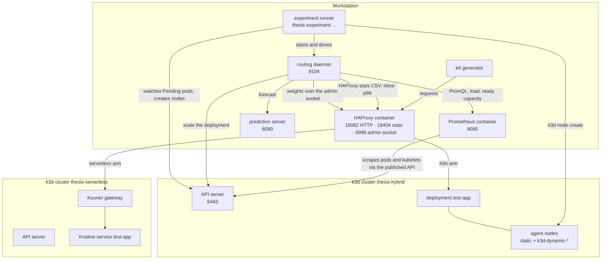
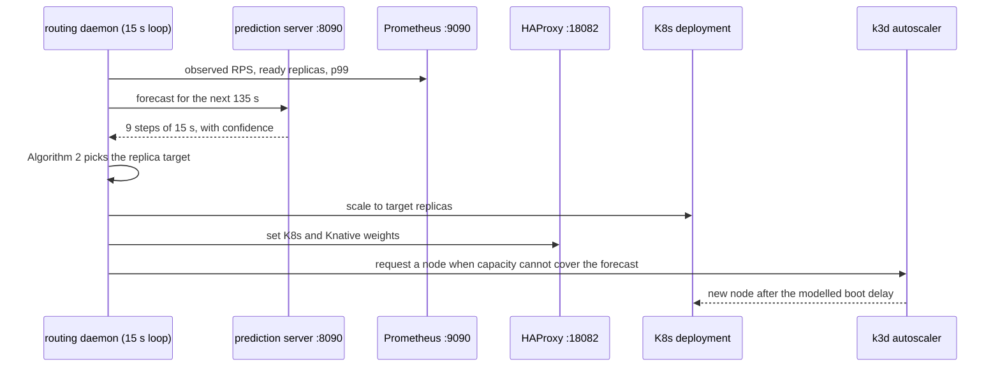

# Understanding the Final Architecture

## Why hybrid control

Kubernetes replicas are warm and economical but have a finite, calibrated capacity. Knative absorbs overflow but has a different cost and startup profile. The experiment compares four designs under one deterministic workload: a K8s baseline, a serverless-only baseline, reactive hybrid control, and predictive hybrid control.

## What runs where

Two k3d clusters, four host processes, three containers. Everything the experiment measures crosses these boundaries.



The autoscaler is the experiment runner's job, not the daemon's. The daemon sets a replica target; if the cluster cannot schedule those pods they stay Pending, and the runner's `K3dAutoscaler` adds a node (`libs/infra/infra/cluster/k3d/autoscaler.py`). That indirection is why a run can be valid at the pod tier and still have measured nothing about the node tier, and why node engagement is a recorded gate.

## The control loop



The forecast drives **scaling**. It never sets a traffic weight directly. Algorithm 1 reads observed load and observed trend, gates the trend path on the GRU confidence, and owns the weight decision.

## Data and control flow

```text
synthetic training series
          |
          v
   GRU: 9 x 15 s = 135 s
          |
          v
Algorithm 2: forecast-informed K8s replica target
          |
observed RPS + ready capacity + HAProxy rtime p99
          |
          v
Algorithm 1 V3: capacity-driven routing
          |
          v
      HAProxy weights
       /          \
 Kubernetes      Knative
```

The GRU is trained on synthetic workload patterns. ClarkNet and Calgary are validation corpora; ClarkNet is replayed as the variable evaluation trace. The 135 s forecast window covers the longest measured provisioning delay (120 s) plus the 15 s safety margin in `CalibrationConfig`.

## Algorithm 1 priority

```text
SCALE_OUT > PREDICTIVE > OPTIMIZE_COST > MAINTAIN
```

- `SCALE_OUT`: an observed SLO violation, or ready capacity below demand. This path overrides everything.
- `PREDICTIVE`: the observed trend approaches capacity, the confidence gate is open, and Algorithm 2 may pre-scale replicas.
- `OPTIMIZE_COST`: observed healthy headroom permits a gradual return toward Kubernetes.
- `MAINTAIN`: no threshold or cooldown allows action.

The routing SLO monitor derives p99 from HAProxy `rtime` and compares it with a 200 ms threshold over a 30 s window, sampling every 15 s (`apps/routing/routing/monitoring/slo_monitor.py`).

## Where the code lives

```text
apps/routing/routing/
├── algorithm/    # Algorithm 1 (V1/V2/V3) and the registry that picks one
├── scaling/      # Algorithm 2: forecast to replica target
├── monitoring/   # SLO monitor: rtime to p99
├── daemon/       # the 15 s loop, the HTTP API on 9104, the state machine
└── clients/      # HAProxy, Prometheus, prediction, K8s seams
apps/prediction/prediction/
├── server.py     # FastAPI on 8090
├── model_loader.py
└── training/     # GRU training and the naive baselines
libs/infra/infra/ # cluster lifecycle, readiness, residue clearing, deploys, Prometheus config
libs/shared/shared/models/calibration.py  # CalibrationConfig: one source for every controller constant
```

## Calibration and workload

`CalibrationConfig` is the single source of truth for controller constants. `apps/routing/routing/algorithm/registry.py` passes `get_calibration().to_v3_config_overrides()` into `Algorithm1ConfigV3`, and the daemon passes `to_scaling_config_overrides()` into Algorithm 2. The dataclass defaults matter only when a controller is built without those overrides, which the daemon never does.

Current values: `r_saturation_per_replica=33.3`, `target_cpu_util=0.5`, so one replica carries 16.65 RPS after the safety margin. Replicas run between 3 and 6. The canonical endpoint is `/fib?n=33`, with 3 pods in the baseline. Node CPU limits come from `uv run thesis infra apply-resources`; run it before an experiment series, not between runs.

## Scenarios and evidence

| Scenario | Description |
|---|---|
| S1 | K8s + HPA baseline |
| S2 | Serverless-only |
| S3 | Hybrid-reactive |
| S4 | Hybrid-predictive |

The definitive H2 paired result at n=5 is S3 p99 188.5 ms against S4 126.0 ms (p=0.0304, d=−1.26) with identical USD 163 monthly cost. H1 is directional at n=1: S4 118.2 ms against S1 2,421.3 ms. The figures and the framing rules live in `results/claims/FINAL_NUMBERS.md`; every claim maps to its bundle in `results/claims/CLAIMS_TO_EVIDENCE.md`.

A result is only readable beside the conditions it was measured under. A paired run on 2026-07-14 provisioned two nodes per run, each costing 59 to 122 seconds, and the predictive arm won. The same design on 2026-09-11 ran with two static agents, provisioned nothing, and the reactive arm won. The bundle records its conditions for this reason; `results/claims/INCONSISTENCIES.md` tracks the known ones.

## Runtime topology

| Component | Port | Role |
|---|---:|---|
| Prediction server | 8090 | GRU inference and confidence |
| Routing daemon | 9104 | Algorithm 1 V3 loop, 15 s interval |
| Prometheus | 9090 | Observed load and readiness metrics |
| HAProxy HTTP | 18082 | Experiment request path |
| HAProxy stats | 18404 | Proxy statistics |
| Streamlit dashboard | 28555 | Finished bundles (`thesis dashboard start`) |

## Running the controllers

Use the governed CLI. It applies the conditions gate, records what ran, and writes the evidence a claim needs.

```bash
uv run thesis experiment preflight --profile h2-pair   # conditions only
uv run thesis experiment reproduce --profile h2-pair   # the full paired design
uv run thesis experiment run --phase full --runs 5 --scenarios s1-k8s-only,s2-serverless-only
```

There is no universal scaling activation time to claim. The measurable target is the p99 < 200 ms SLO, and the controllers' scale and routing behaviour is reported per run in the evidence bundles.
