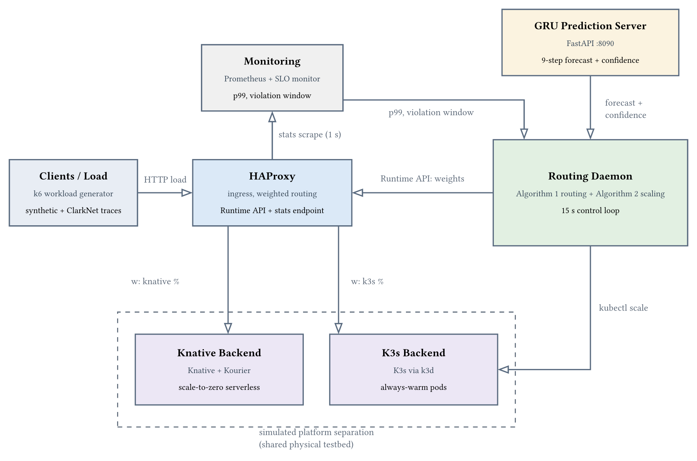
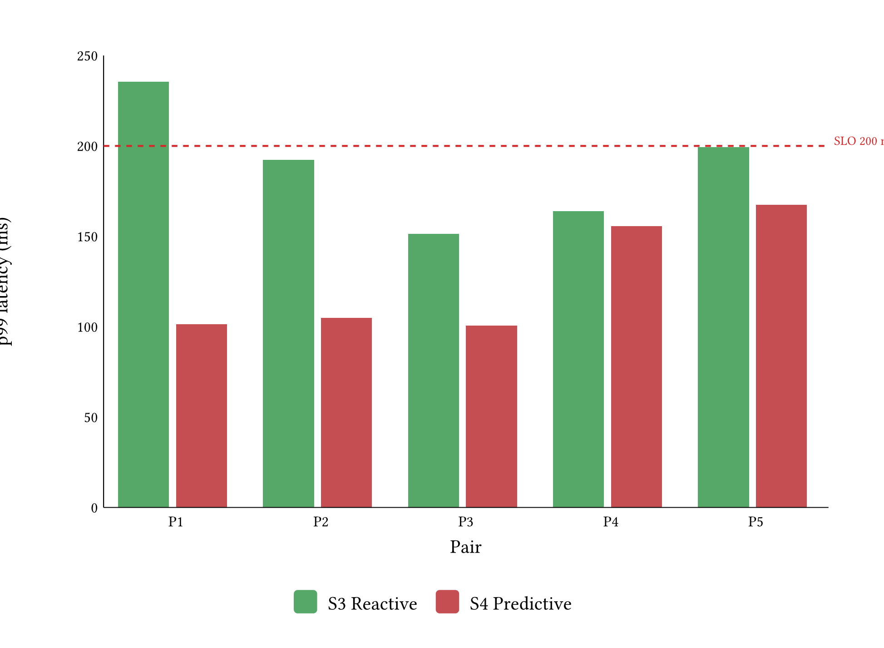

**Ringkasan Penelitian Tesis**

**Nama** : Muhammad Zahid Masruri | **NRP** : 6025221041 | **Prodi** : Magister Komputer (M.Kom), Teknik Informatika, ITS, 10 September 2026
**Judul** : Decision Making and Elastic Scalability Management in Heterogeneous Cloud Environments Based on Workload Prediction

**Konteks.** Kubernetes hemat karena kontrol penuh terhadap node cluster, tetapi autoscaler bawaannya lambat: bereaksi setelah beban naik. Serverless (Knative) menambah kapasitas dalam hitungan detik, tetapi lebih mahal untuk beban yang berlangsung lama. Penelitian ini menggabungkan keduanya dengan prediksi workload GRU. Dua keputusan yang dijawab: kapan kapasitas Kubernetes ditambah, kapan trafik dialihkan ke serverless.

**Mengapa penting.** Provisioning node memerlukan 45 sampai 120 detik, lebih lama daripada waktu reaksi controller, sehingga kapasitas baru siap setelah peak traffic lewat. Research yang membandingkan controller reactive dan prediktif pada kasus hybrid masih terbatas.

**Rumusan masalah.** (1) Bagaimana merancang prediksi workload trafik aplikasi web menggunakan GRU? (2) Bagaimana memodifikasi algoritma ElaX untuk cluster scaling dan trafik distribution ke tipe klaster berbeda? (3) Bagaimana mengevaluasi mekanisme tersebut pada lingkungan terintegrasi Kubernetes dan serverless?

**Metodologi.** Model GRU:

- Input: 30 sampel trafik terakhir, sampling time 15 detik
- Output: 9 langkah prediksi, horizon 135 detik
- Pelatihan: data sintetis 72 jam, hyperparameter via Optuna
- Validasi: jejak HTTP ClarkNet dan Calgary

ElaX dimodifikasi jadi dua algoritma:

- **Algoritma 1 (routing).** Tiap 15 detik cek p99 terhadap SLO lalu geser weight HAProxy. SLO dilanggar: naikkan weight serverless. GRU meramalkan lonjakan: siapkan kapasitas lebih awal. Stabil: balik ke Kubernetes.
- **Algoritma 2 (scaling).** Jumlah pod dihitung dengan rumus sederhana R = alfa dikali x ditambah beta. Mode reactive pakai observed load; mode prediktif pakai forecast GRU kalau forecast-nya lebih tinggi.
- **Node consolidation.** Seperti Cluster Autoscaler: di bawah 50% utilisasi dan pod-nya bisa dipindah, node dihapus.

{width=15.5cm}

Empat skenario dibandingkan, dengan traffic load dari trace ClarkNet 22~164 RPS, metrik utama p99 (SLO 200 ms), dan S3 vs S4 diuji dengan 5 pasangan (uji permutasi satu arah, alpha 0,05):

| Skenario | Scaling | Trafik |
|---|---|---|
| S1 Kubernetes | HPA bawaan | 100% Kubernetes |
| S2 serverless | KPA (Knative) | 100% serverless |
| S3 hybrid reactive | Algoritma 1 + 2, observed load | dinamis Kubernetes dan serverless |
| S4 hybrid prediktif | Algoritma 1 + 2, forecast GRU | dinamis Kubernetes dan serverless |

**Hasil evaluasi.** Replikasi empat skenario (n = 5 per skenario):

| Skenario | p99 rata-rata (ms) | SLO violations |
|---|---|---|
| S1 | 110,3 | 253 |
| S2 | 79,7 | 2 |
| S3 | 151,6 | 1.998 |
| S4 | 99,1 | 92 |

Hasil utama, perbandingan berpasangan definitive (n = 5 pasangan):

| Metrik | S3 reactive | S4 prediktif |
|---|---|---|
| p99 (ms) | 188,5 | 126,0, turun 33,1% (p = 0,030; d = -1,26) |
| SLO violations | 656 | 130, turun 80,2% |
| Biaya per bulan | USD 163 | USD 163, sama |

{width=13cm}

- Replication batch lanjutan mempertahankan arah S4 (batch terakhir p = 0,032)
- Catatan: saturasi S1 2.421 ms pada diagnostik n=1 tidak terulang di replikasi n=5 (S1 110,3 ms); keunggulan lawan Kubernetes murni jadi sekitar 10% dan belum diuji signifikansi

- Akurasi GRU: model live (dilatih sintetis, dipakai eksperimen) RMSE 4,75% di test set sintetis; varian yang dilatih langsung pada ClarkNet mencapai 17,78% di test split-nya (agregasi 5 menit)
- Model live sengaja dilatih sintetis: beban replay adalah ClarkNet itu sendiri, jadi melatih model pada trace yang sama memberi S4 keuntungan hafalan dan membuat perbandingan tidak adil

| Komponen | Cara hitung |
|---|---|
| Node Kubernetes | EC2 t3.medium USD 0,0416/jam kali node lifetime terukur (dari provision event) |
| Control plane | EKS per jam |
| Serverless | Lambda Provisioned Concurrency: jumlah instance = RPS kali execution time, ditagih per 300 detik |
| Batasan model | Warm replica tidak terhitung; S4 5 replika vs S3 3, sekitar USD 2,2/bulan lebih jika per vCPU-detik |

**Kesimpulan.**

- (1) GRU sesuai target akurasi dan cukup cepat untuk keputusan real-time
- (2) ElaX menjadi 2 algoritma; PREDICTIVE aktif sebelum SLO dilanggar
- (3) Hybrid prediktif 33,1% lebih cepat di p99, SLO violations turun 80,2%, biaya sama, signifikan statistik
- Berlaku dengan 3 syarat: horizon forecast menutupi jeda provisioning node, node consolidation mengikuti Cluster Autoscaler, baseline reactive disetel wajar
